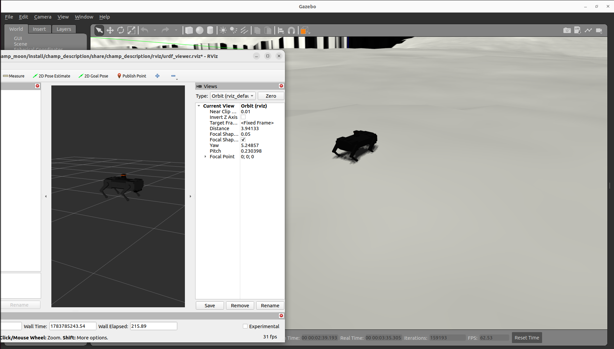
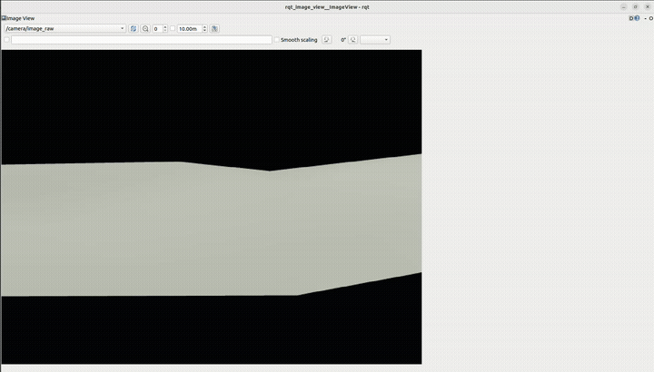

# Champ in Moon

The [CHAMP](https://github.com/chvmp/champ) quadruped robot walking and mapping a real lunar
terrain in Gazebo Classic (ROS 2 Humble).

The terrain is a real NASA LRO heightmap of the **Lunar Tranquillitatis Pit**
(from Gazebo's Fuel asset library, OpenRobotics), dropped into a custom world alongside CHAMP's
existing gait controller and LiDAR-based SLAM stack.




CHAMP also carries a front-facing RGB-D camera, so you can see the terrain from its own point of
view while it walks:



## What's here

Two packages: `champ_moon_bringup`, which layers the lunar world and bringup config on top of the
upstream CHAMP packages (not included here, see setup below), and `champ_nav2_controller`, a
custom Nav2 controller plugin purpose-built for CHAMP's gait.

**`champ_moon_bringup`:**
- `worlds/moon.world` - the lunar terrain + CHAMP robot world
- `models/lunar_tranquillitatis_pit/` - the downloaded heightmap terrain model
- `launch/moon_gazebo.launch.py` - custom launch file; adds a `world_init_z` spawn-height
  override that CHAMP's own launch wrapper doesn't expose
- `launch/moon_navigate.launch.py` - launches Nav2 (`nav2_bringup`) + RViz on the saved map
- `config/slam.yaml` - CHAMP's slam_toolbox config, with `transform_timeout` raised from 0.2s to
  1.5s for stability on this terrain
- `config/nav2_params.yaml` - Nav2 stack config, using the custom controller below for path
  following
- `rviz/nav_view.rviz` - RViz config for viewing the robot, LiDAR scan, and map
- `maps/moon_map.pgm` / `.yaml` - a saved SLAM map from manual teleop exploration (~27.6m x 25m)

**`champ_nav2_controller`:** a custom `nav2_core::Controller` plugin, written because Nav2's stock
`RegulatedPurePursuitController` assumes wheeled-robot-like velocity tracking that CHAMP's legged
gait can't deliver - a direct `cmd_vel`-vs-`odom` measurement showed the gait only achieves ~41% of
a commanded angular velocity when rotating in place. This controller:
- follows the path with pure-pursuit + a rotate-to-heading gate, using speed limits that reflect
  what the gait can actually do
- continuously compares what it *commanded* last cycle against what Nav2 reports the robot
  *actually* achieved (from odometry) every control cycle, and maintains a live self-correcting
  scale factor instead of trusting a fixed assumption

On the same test goal, the stock (tuned) controller racked up 10 recovery behaviors and ultimately
failed to reach the goal; this controller reached it in 1 recovery and ~146s.

## Setup

Requires ROS 2 Humble and Gazebo Classic 11.

```bash
mkdir -p champ_moon_ws/src && cd champ_moon_ws/src
git clone https://github.com/biswajeetpandaisreal-arch/Champ_in_moon.git champ_moon_bringup
git clone https://github.com/chvmp/champ.git
git clone https://github.com/chvmp/champ_teleop.git
cd ..
rosdep install --from-paths src --ignore-src -r -y
colcon build
source install/setup.bash
```

## Running

Launch the robot in the lunar world:

```bash
ros2 launch champ_moon_bringup moon_gazebo.launch.py rviz:=true
```

Drive it around with teleop, and run `slam_toolbox` to map the terrain (see `config/slam.yaml`).
The included `maps/moon_map.*` is a map already produced this way.

## Notes / known issues

- **Gravity is Earth-normal (-9.8), not lunar (-1.622).** Real lunar gravity was tried first, but
  CHAMP's gait controller is tuned for Earth ground-reaction forces and hopped/bounced
  uncontrollably under it, which also broke SLAM scan-matching. Terrain and lighting are lunar;
  physics is not (yet).
- Spawn point `(-42.4, -42.4)` was chosen after verifying it's flat via direct heightmap pixel
  analysis, well clear of the crater near the terrain's center.
- There's a harmless `gazebo_ros2_control` "Parameter 'hold_joints' has already been declared"
  warning that causes a slight idle standing wobble; walking is unaffected.
- SLAM mapping so far was done manually via teleop, not autonomous exploration.

## Roadmap

- [ ] Nav2 on the saved map for autonomous navigation
- [ ] VS Code task automation to launch Gazebo/teleop/SLAM/RViz together
- [ ] Autonomous frontier exploration for mapping

## Credits

- [chvmp/champ](https://github.com/chvmp/champ) and
  [chvmp/champ_teleop](https://github.com/chvmp/champ_teleop) - the underlying quadruped stack
- Lunar Tranquillitatis Pit terrain - NASA LRO data via Gazebo Fuel, OpenRobotics
